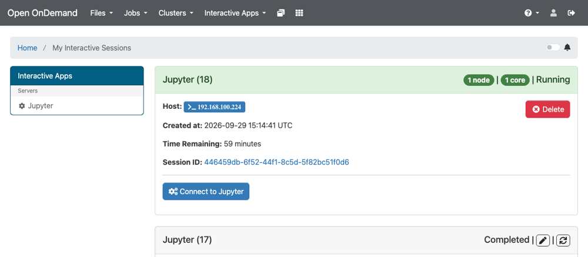
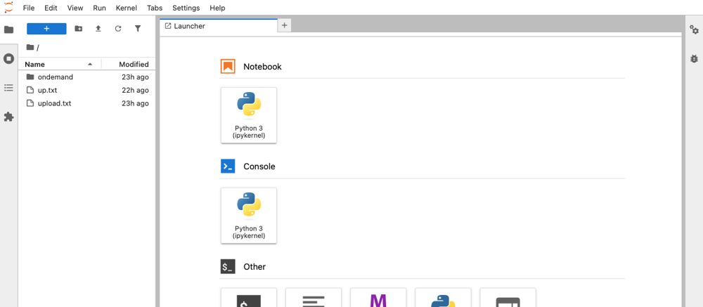

# Features and Usage

## Inputs

| Input | Tab | Default | Description |
|---|---|---|---|
| `ONEAPP_PORTAL_HOST_NAME` | Portal | empty | Public DNS name. Empty uses the IP of the VM. |
| `ONEAPP_PORTAL_LETSENCRYPT_ENABLED` | Portal | `NO` | Certificate from Let's Encrypt. Needs the DNS name and port 80 open to the internet. |
| `ONEAPP_PORTAL_CERTIFICATE_ENABLED` | Portal | `NO` | Your own certificate, with `ONEAPP_PORTAL_CERTIFICATE_CHAIN` and `ONEAPP_PORTAL_CERTIFICATE_KEY` in PEM. |
| `ONEAPP_LDAP_SERVER_URL` | LDAP | required | URL of the directory, such as `ldap://10.0.0.5`. |
| `ONEAPP_LDAP_SERVER_DOMAIN` | LDAP | `slurm.local` | Domain or base DN, the same value as `ONEAPP_LDAP_DOMAIN` in OneSlurm. |
| `ONEAPP_LDAP_BIND_USER`, `ONEAPP_LDAP_BIND_PASSWORD` | LDAP | empty | Only for a directory without anonymous searches. |
| `ONEAPP_HOME_NFS_EXPORT` | Home | empty | NFS export of the homes, the same value as `ONEAPP_SLURM_NFS_HOME`. |
| `ONEAPP_SLURM_CLUSTERS_LIST` | Slurm | empty | Clusters as `name:IP` pairs separated by spaces. |

Without a certificate input, the portal uses a self-signed certificate. With Let's Encrypt, it gets the certificate at boot and renews it automatically.

## Clusters

The portal writes one Open OnDemand cluster file for each `name:IP` pair. Every cluster must use the same LDAP directory and NFS home as the portal.

To add or remove a cluster later, change `ONEAPP_SLURM_CLUSTERS_LIST` with **Update Configuration** in Sunstone or with `onevm updateconf`. The portal applies the change on its own, and users log in again. New OneSlurm clusters do not register in the portal automatically.

## Users and Homes

The portal reads the users from the LDAP directory, and each session runs as the Unix user with the same uid as on the clusters. When a home does not exist, the portal creates it if the NFS export lets root write. Otherwise, create it as the OneSlurm guide explains.

For each user, the portal creates the SSH key `~/.ssh/id_ed25519_portal` and authorizes it only from the addresses of the portal.

## Jupyter

The **Jupyter** app starts JupyterLab on a node of a cluster. It runs the JupyterLab of the user, so the nodes need nothing else. To install it once, open a terminal on the cluster and run these commands.

```
curl -LsSf https://astral.sh/uv/install.sh | sh
~/.local/bin/uv venv ~/.venvs/jupyter
source ~/.venvs/jupyter/bin/activate
~/.local/bin/uv pip install jupyterlab
```

Each session has its own token, so other users cannot open it.





## Security

* The portal pins the SSH host key of each controller at the first boot. To accept a new key, run `ssh-keygen -R <IP> -f /etc/ood/ssh/known_hosts` on the portal and update its configuration.
* The LDAP directory of a OneSlurm controller has no TLS, so login passwords travel in clear text. Use `ldaps://` when the directory supports it.

## Limitations

* No remote desktop app, because the OneSlurm nodes have no VNC server.
* The Module Browser is empty, because the OneSlurm nodes have no Lmod.
* The accounting fields are empty, because OneSlurm has no Slurm database.
