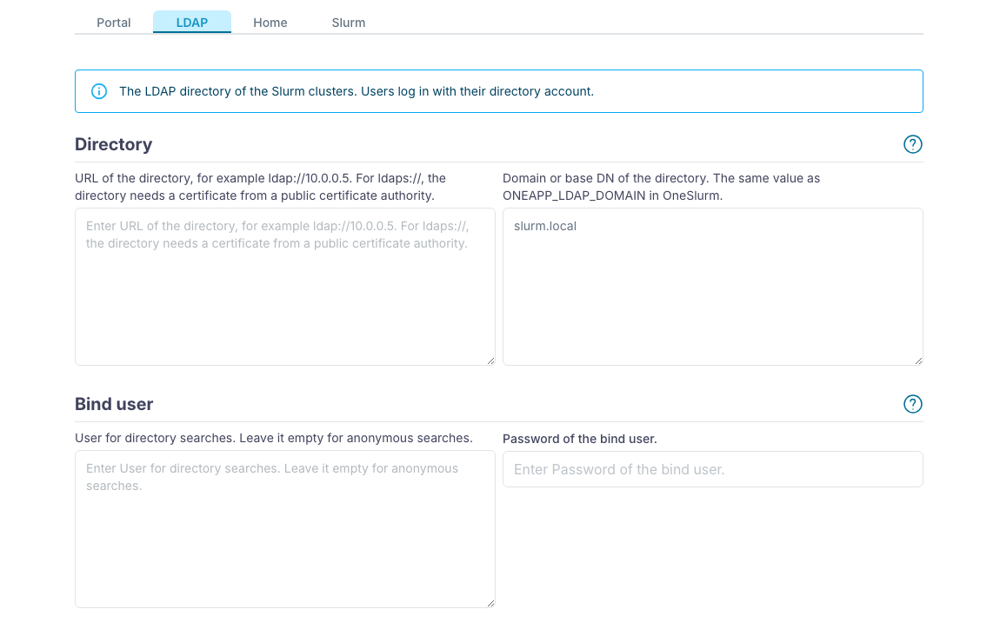
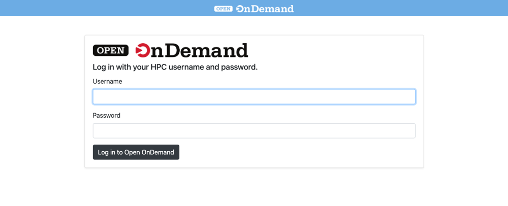
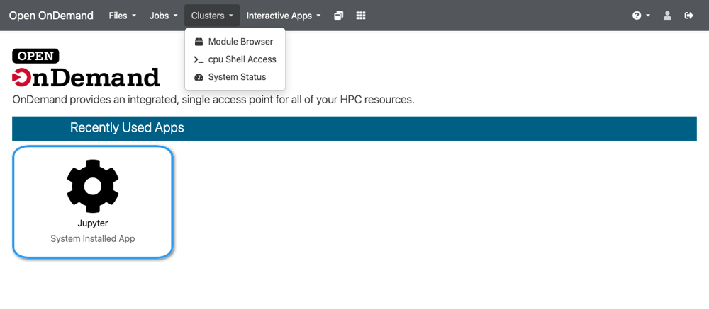
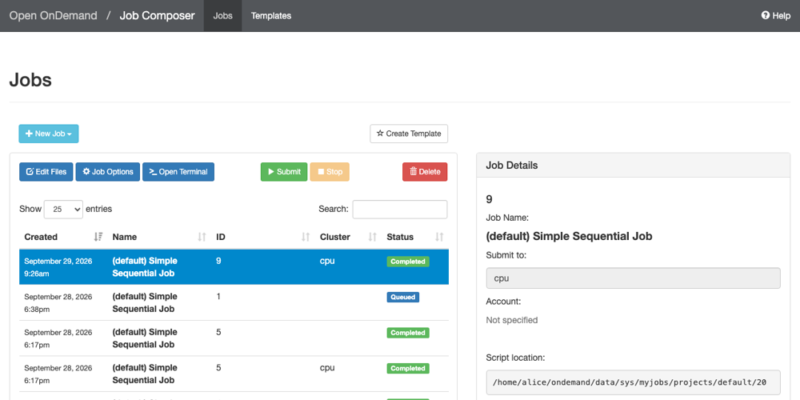
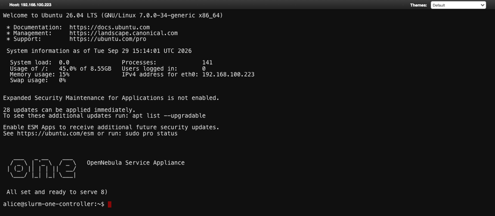

# Quick Start

This guide connects a portal to one OneSlurm cluster.

## Prepare the Cluster

1. Create an NFS export for the homes, for example `10.0.0.2:/export/home`.
2. Deploy the OneSlurm service with `ONEAPP_LDAP_ENABLE` set to `YES`, so the controller runs the LDAP directory, and with `ONEAPP_SLURM_NFS_HOME` set to `10.0.0.2:/export/home`.
3. Add the users to the directory and create their homes, as the [OneSlurm guide](slurm_feature) explains.

## Deploy the Portal

1. Export **Service Open OnDemand** from the OpenNebula Marketplace.

   ```
   onemarketapp export 'Service Open OnDemand' open-ondemand --datastore default
   ```

2. Instantiate the VM template and fill the wizard. In **Advanced options**, add a NIC on the network of the cluster.

   | Tab | Input | Value |
   |---|---|---|
   | LDAP | URL of the directory | `ldap://<controller IP>` |
   | LDAP | Domain | `slurm.local`, as in OneSlurm |
   | Home | NFS export | `10.0.0.2:/export/home` |
   | Slurm | Clusters | `cpu:<controller IP>` |

   

3. Wait until the VM shows `READY=YES`. The attribute `OOD_URL` has the address of the portal. A wrong input stops the boot, and `OOD_ERROR` explains the problem.

## Log In

Open `OOD_URL` in a browser and log in with a directory account. Without your own certificate, the browser warns about the self-signed one.





## Run a Job

Open **Jobs > Job Composer**, create a job from the default template and click **Submit**. **Jobs > Active Jobs** shows it while it runs.



## Open a Terminal

Open **Clusters > cpu Shell Access**. The terminal opens on the controller as the user.


